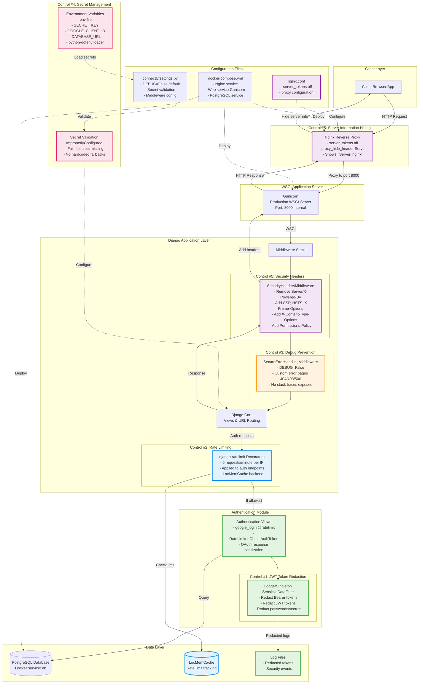
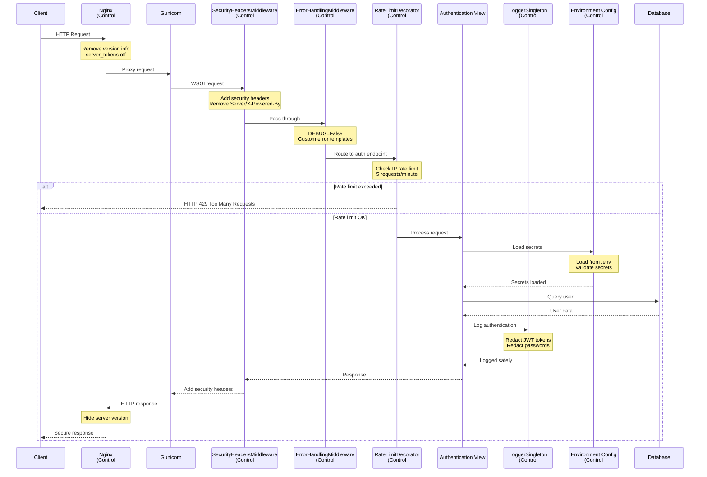
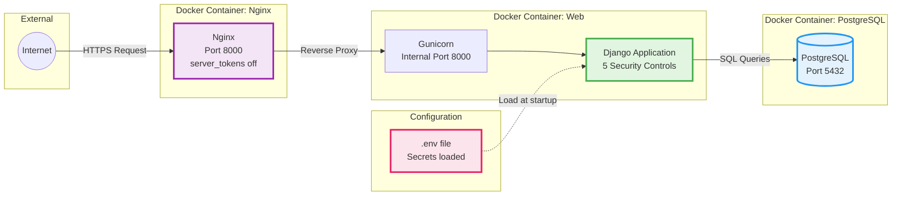

# ConnectlyIPT Security Controls - System Architecture Diagram

## Milestone 2 Implementation - Controls 1-5



## Control Summary

| Control # | Name | Components | Status |
|-----------|------|------------|--------|
| **Control #1** | JWT Token Redaction | LoggerSingleton, SensitiveDataFilter | ✅ PASS |
| **Control #2** | Rate Limiting | django-ratelimit, LocMemCache | ✅ PASS |
| **Control #3** | Debug Prevention | DEBUG=False, Custom error pages, SecureErrorHandlingMiddleware | ✅ PASS |
| **Control #4** | Secret Management | python-dotenv, .env, ImproperlyConfigured validation | ✅ PASS |
| **Control #5** | Server Info Hiding | Nginx reverse proxy, SecurityHeadersMiddleware | ✅ PASS |

## Request Flow Diagram



## Production Architecture



## Security Controls Mapping

### Control #1: JWT Token Redaction (Green)
- **Component**: `singletons/logger_singleton.py`
- **Flow**: All log messages → SensitiveDataFilter → Redaction → Log files
- **Pattern Matching**: Bearer tokens, JWT, access_token, passwords, secrets

### Control #2: Rate Limiting (Blue)
- **Component**: `django-ratelimit` decorators
- **Flow**: Auth request → Check cache → Allow/Block based on IP
- **Backend**: Django LocMemCache (5 requests/minute)

### Control #3: Debug Prevention (Orange)
- **Component**: `SecureErrorHandlingMiddleware`
- **Flow**: Exception → Custom error page (404/403/500) → No stack trace
- **Configuration**: DEBUG=False by default

### Control #4: Secret Management (Pink)
- **Component**: `python-dotenv` + `.env` file
- **Flow**: App startup → Load .env → Validate → ImproperlyConfigured if missing
- **Secrets**: SECRET_KEY, GOOGLE_CLIENT_ID, DATABASE_URL

### Control #5: Server Information Hiding (Purple)
- **Component**: Nginx + SecurityHeadersMiddleware
- **Flow**: Response → Add security headers → Nginx removes version → Client
- **Headers**: CSP, HSTS, X-Frame-Options, removes Server header version

## File Locations

```
school-connectly/
├── authentication/
│   ├── views.py                          # Control #1, #2: Rate limited auth views
│   ├── security_headers_middleware.py    # Control #5: Security headers
│   └── error_handling_middleware.py      # Control #3: Secure error handling
├── singletons/
│   └── logger_singleton.py               # Control #1: Token redaction
├── connectly/
│   ├── settings.py                       # Control #3, #4: DEBUG, secrets validation
│   └── wsgi.py                           # Control #5: WSGI wrapper
├── .env                                  # Control #4: Environment secrets
├── nginx.conf                            # Control #5: Nginx configuration
├── docker-compose.yml                    # Control #5: Production deployment
└── gunicorn_config.py                    # Control #5: Gunicorn config
```

---

**Diagram Version**: 1.0
**Last Updated**: 2025-10-04
**Status**: Complete - All 5 controls documented
